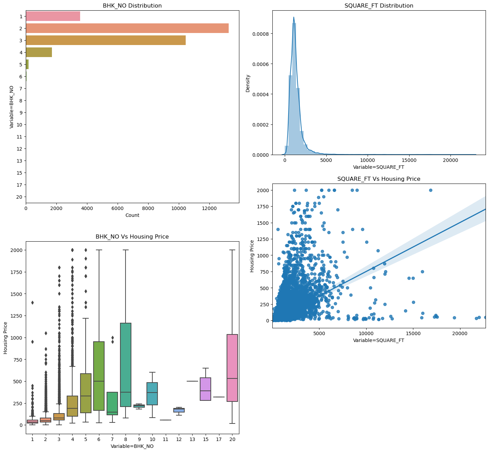
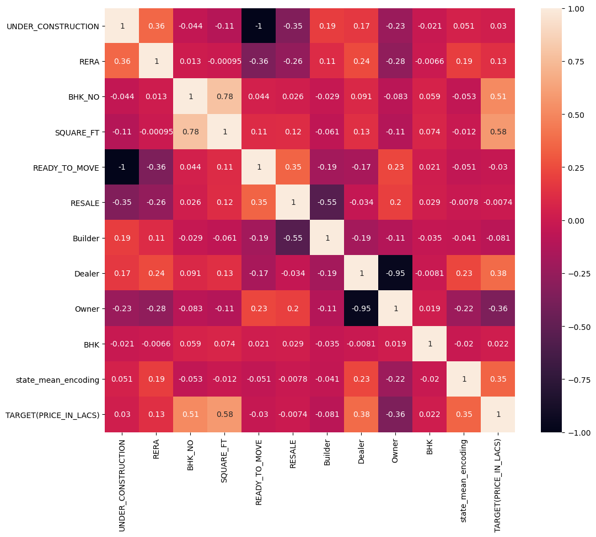
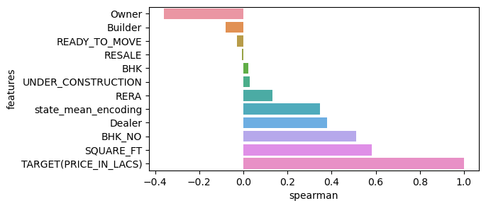
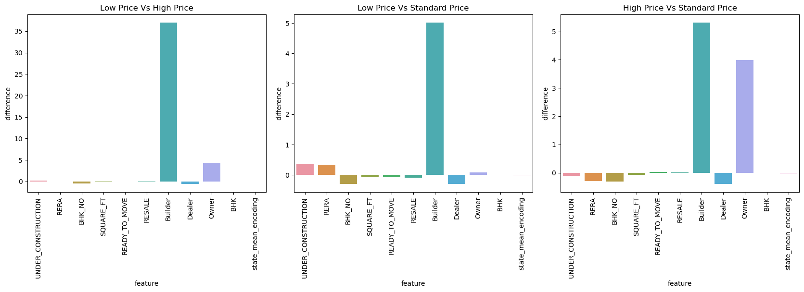
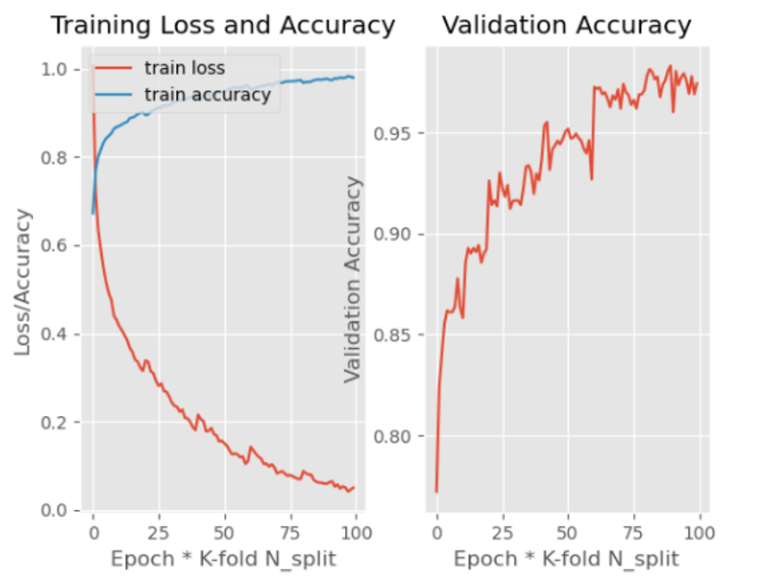
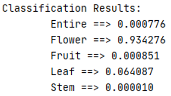

# Qing Li's Portfolio

## [Project 1: Indian Housing Price Analysis and Prediction](https://github.com/loliamserious/SOEN6111-BIG-DATA)
* Analyzed 29451 lines of data and 12 influencing factors of Indian housing prices to help understand buyer behaviors through exploratory data analysis (EDA)
* Forecasted Indian housing price with 0.05 RMSE and 64.3% R2 through implementation of random forest regressor and gradient-boosted regressor
* Extracted meaningful information from data through visualization of distribution and calculation of correlation using python, PySpark and pandas 
* Engineered features put on knowing inter-quartile range (IQR), PySpark, transformation, normalization, encoding and sklearn
* Optimized random forest regression and gradient-boosted regression model using GridsearchCV to reach the final result

  

   Figure 1.

## [Project 2: Plant External Structure Classification System Based on CNN](https://github.com/loliamserious/ML-project)
This project is mainly based on finetune VGG-16 network to train the models to extract and learn features of different types of plant structures, so that we can find the appropriate spatial classification boundaries and place different types of samples in their respective regions.

* For the data preprocessing, I first divide the dataset into five categories, then scale the image into 100*100, and solve the problem of imbalance data by assigning different penalty weight to different categories. 
* And then I used VGG-16 with fine-tune as our training model, and combined with K-fold cross validation to further improve the prediction accuracy of the model. Finally, this model reachs the accuracy of 83.44% and the loss of 7.53% in epoch 20(Figure 2). 
* I also developed a client facing API for this model which shows the high prediction accuracy after inputting untrained plant images. For example,if we input something like the flower on the left in Figure 3. After the calculation of the model, a set of predicted values will be obtained, the classification with the largest predicted value is the final result.

   Figure 2.

   Figure 3.

