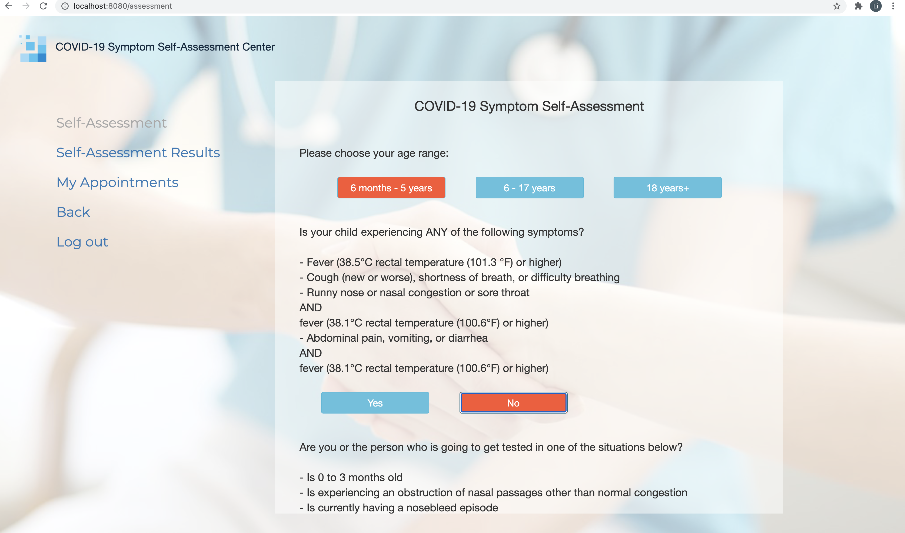
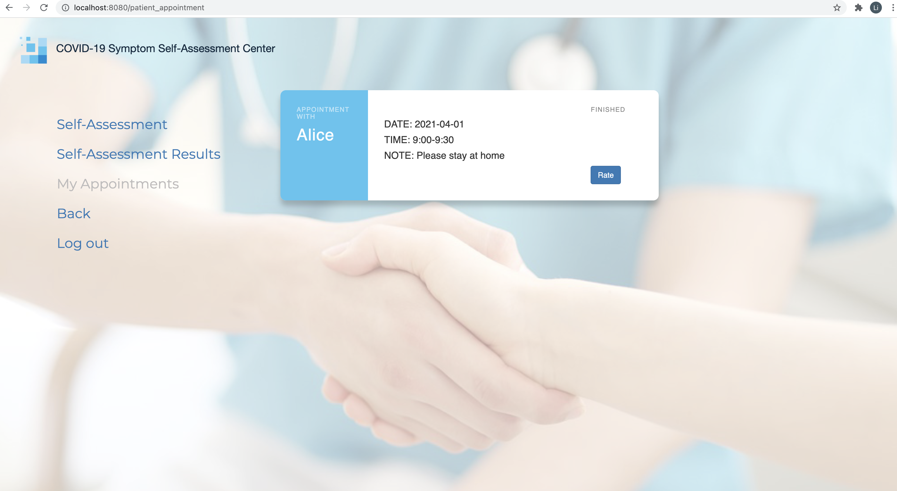
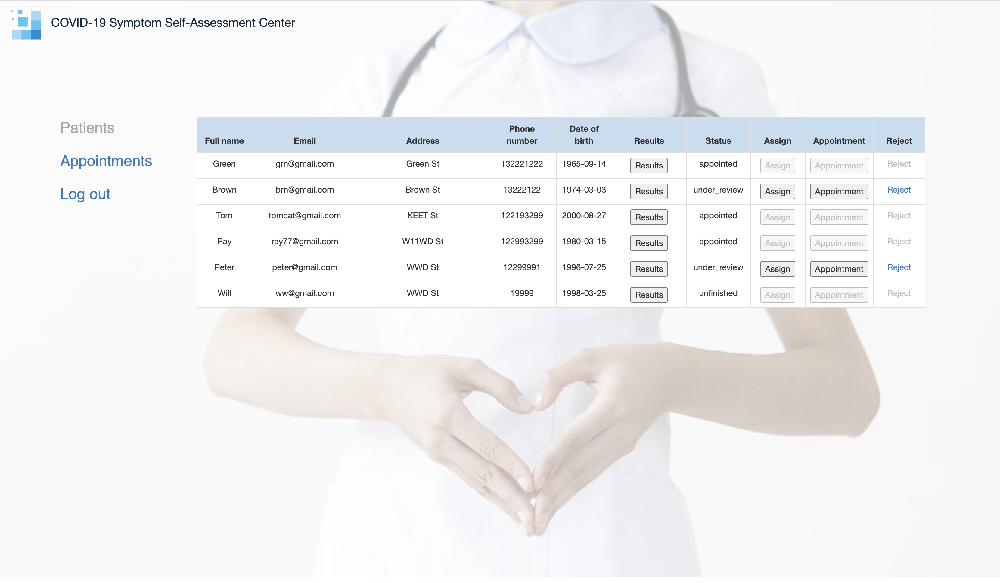
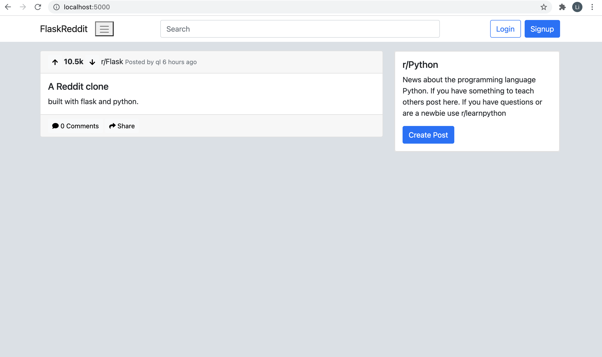
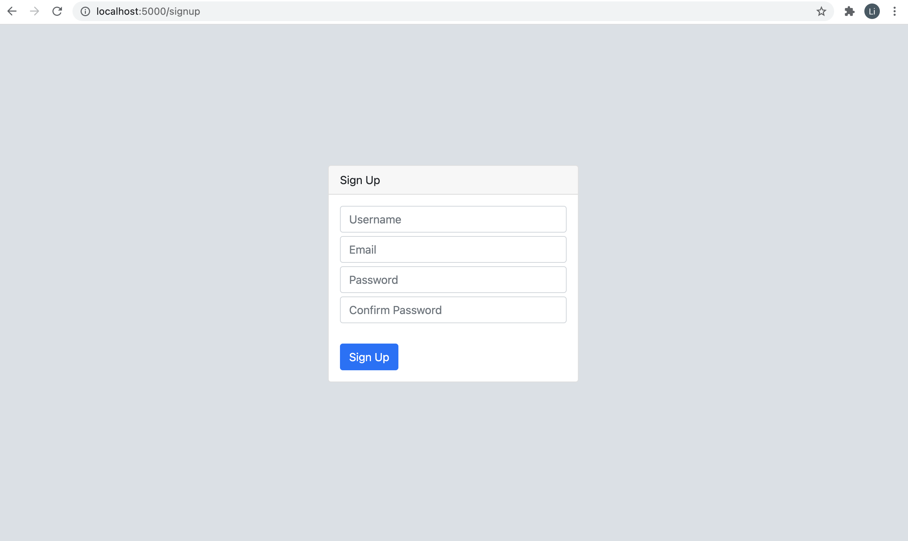

# Qing Li's Portfolio

## [Project 1: Medical Website for Collecting Data of COVID-19 Patients](https://github.com/loliamserious/SOEN6841)
A website to help patients, nurses and doctors to have access faster to medical system regard to COVID-19. 

In this system, patients are able to register and perform a self-assessment test in order to get help from a doctor or a nurse, and to rate health care workers after completing appointments. Nurses and doctors will determine to consult more with the patient by giving him/her appointment, or not accepting the patient because melt symptoms. All the data will be stored in a database in order to provide different type of reports for the management.

Technical details:
* Developed a website for COVID-19 to collect data from patients with agile approach including 3 sprints
* Created REST APIs including authentication, making appointments, ajax form questionnaires and report generation
* Built our backend server with SpringBoot framework, with JavaScript and BootStrap for frontend, GitHub as version control system, MySQL as database, JIRA as PMT.

  
  
  

## [Project 2: Reddit Clone with Python and Flask](https://github.com/loliamserious/FlaskReddit)
* Developed a simple Reddit clone website based on REST architecture
* Built REST authentication APIs including login and signup, salted and encrypted password with MD5 hashing algorithm
* Hosted backend server on Heroku(cloud platform as a service - PaaS), and used Flask as the web framework and Flask-sqlalchemy as the object-relational mapping
* Designed beautiful frontend theme by using HTML, CSS and Bootstrap

  

## [Project 3: Indian Housing Price Analysis and Prediction](https://github.com/loliamserious/SOEN6111-BIG-DATA)
* Analyzed 29451 lines of data and 12 influencing factors of Indian housing prices to help understand buyer behaviors through exploratory data analysis (EDA)
* Forecasted Indian housing price with 0.05 RMSE and 64.3% R2 through implementation of random forest regressor and gradient-boosted regressor
* Extracted meaningful information from data through visualization of distribution and calculation of correlation using python, PySpark and pandas 
* Engineered features put on knowing inter-quartile range (IQR), PySpark, transformation, normalization, encoding and sklearn
* Optimized random forest regression and gradient-boosted regression model using GridsearchCV to reach the final result

  

## [Project 4: Plant External Structure Classification System Based on CNN](https://github.com/loliamserious/ML-project)
This project is mainly based on finetune VGG-16 network to train the models to extract and learn features of different types of plant structures.

* For the data preprocessing, I first divide the dataset into five categories, then scale the image into 100*100, and solve the problem of imbalance data by assigning different penalty weight to different categories. 
* And then I used VGG-16 with fine-tune as our training model, and combined with K-fold cross validation to further improve the prediction accuracy of the model. Finally, this model reachs the accuracy of 83.44% and the loss of 7.53% in epoch 20. 
* I also developed a client facing API for this model which shows the high prediction accuracy after inputting untrained plant images. If we input something like the flower on the left, a set of predicted values will be obtained, the classification with the largest predicted value is the final result.

